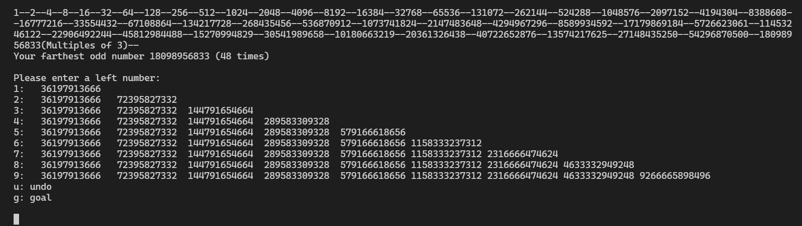

# collatz

コラッツ予想（＾～＾）

  
👆 maze.py  

## Run

迷路(Maze):  

```shell
python maze.py
```

筆算表示(Calculating on paper like):  

```shell
python main.py
```

ライフゲーム表示(Lifegame like):  

```shell
python lifegame.py
```

左寄せライフゲーム表示(Lifegame like, Left justified):  

```shell
python lifegame_lj.py
```

木を生やす。左寄せライフゲーム表示(Lifegame like, Left justified, Reverse):  

```shell
python lifegame_lj_rev.py
```

## Settings

```shell
# 基数
# Default: 10
set RADIX=4

# 探索の深さ
# Default: 8
# using: lifegame_lj_rev.py
# ある程度、探索の幅が広くないと深くもならないぜ（＾～＾）
set DEPTH=3

# 探索の幅
# Default: 4
# using: lifegame_lj_rev.py
set BREADTH=5
```
